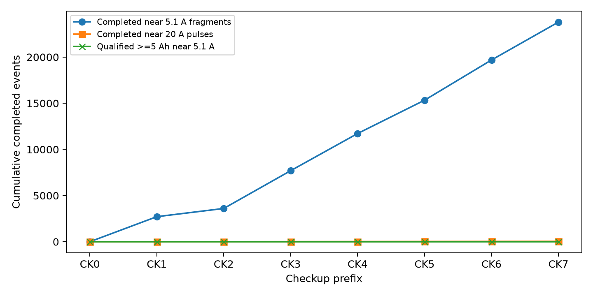
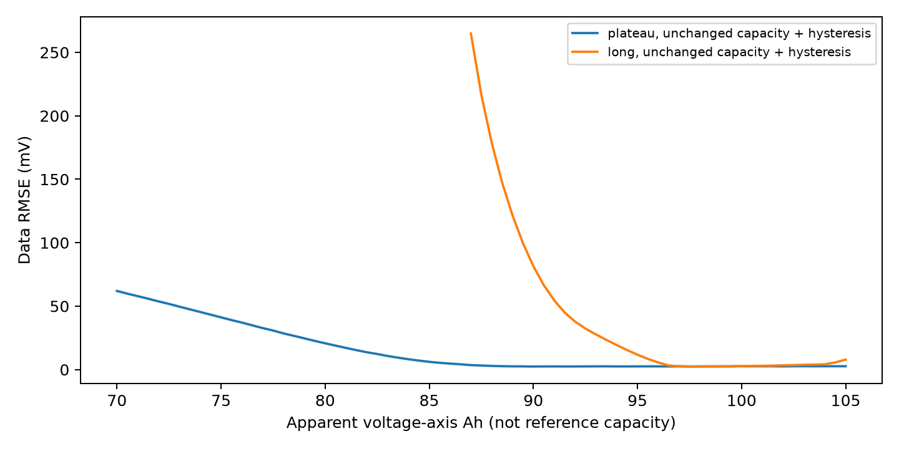
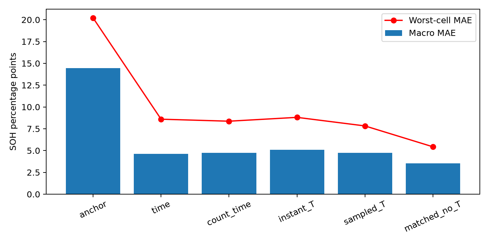

# LFP SOH 第二阶段：文献驱动验证与 R02/R05 双路线决策报告

版本：2026-09-29。证据口径：本轮 V0–V8 研究。项目根目录为 `/Users/shane/Desktop/Arena 阶段 2 官方材料`。所有新代码、原始运行记录和逐点结果位于 `research/phase2_evidence_validation/`。本报告面向新加入队友，区分**研究完成**、**D1 代理指标**和**官方真实容量性能**。

## 1．结论与决策

本轮已完成 R02 带载模板的可执行原型、CK0 回代、合成反证和官方因果回退；也完成 R05 的六芯、180 目标、严格前缀、内外留芯代理验证。**两个路线均未证明可改善官方 CK1–CK7 的容量预测**：官方只公开 CK0=100.41 Ah，隐藏 CK1–CK7 真值；本地没有新采集、同四串/5.1 A/组端 11.2 V 协议的独立容量标签。D1 是六枚 P1 单芯深充记录裁成的浅充代理，不能把它的容量误差改称四串组误差。

V1 从官方运行日志重建 68,366 个事件片段。25,182 个接近 5.1 A 的片段中，最大连续放出约 **0.2385 Ah**，没有达到预注册探索门槛 5 Ah；41 个约 20 A 脉冲中位积分约 **10.200 Ah**，但放电计数器中位增量为 0、充电计数器约 10.143 Ah，说明该模式的计数器方向需校核。R02 缺少可将运行短片映射到参考满充容量的足够证据，官方更新门保持关闭；候选按冻结 R01 返回 **100.41/102×100=98.441%**。此值在 CK0 与发布结果一致，CK1–CK7 准确率不可评价。

R05 的 D1 平均优先留芯结果：采样温度历史宏 MAE **4.759 pp**、最差芯 **7.825 pp**、末期 **6.892 pp**；等维度非温度前缀基函数分别为 **3.521、5.434、6.530 pp**。在这个信息预算、特征族和六芯开发集上，加入采样温度历史没有稳定增量；这不排除真正连续热历史在新组数据中的作用。内层选出的混合臂宏 MAE **5.147 pp**，尾部优先规则反而变为 **5.680 pp**、末期 **9.385 pp**。高性能目标宏≤1、最差≤2、单点最大≤5 pp **均未达到**；历史冻结 TCN 宏 2.851 pp、最差 5.572 pp，仍是同六芯上的更好开发参考，也没有官方容量确认。

路线决策：**R02 保留为待测参考状态与长近工况事件后的受控容量研究；R05 保留为待同协议真实组标签和完整热史后的低自由度先验；当前官方候选只用 R01 回退。**比赛的下一步应先比较官方示例的局部充电计量基线与当前保守回退，修正脉冲计数器异常并做严格因果检查，再用有限、预先登记的候选争取官方榜单反馈。新物理四串组的重复 RPT、真实浅充与匹配脉冲是研究验证优先项；官方说明禁止私有/专有外部数据，除非数据满足公开、许可和可复现要求且获赛事规则允许，否则不能用于比赛模型训练或选择。

## 2．目标、证据层级与材料关系

官方目标是四串 102 Ah LFP 组满充后，以 5.1 A 放电到**组端电压首次达到 11.2 V**的放出 Ah 除以 102 Ah。组端截止、参考满充和参考温度不可用单芯 2.8 V、阻抗、充电入量或后验深充裁片替代。CK0 原始曲线的首次截止根为 100.412 Ah，官方公布 100.41 Ah；两者差约 0.002 Ah，符合原始输出精度。CK0 组压减四芯压和的中位数约 −3 mV，95% 绝对分位约 5 mV，因此 R02 主输出应对齐实测组端。

本轮用 D0 表示 P1 原始深循环历史；D1 表示同六芯的严格可见前缀、20 Ah、首个 3.50 V 越线裁片及高倍率单芯放电代理目标；D2-compatible 表示独立新四串且同官方容量协议；D2-transfer 表示独立但化学/拓扑/参考协议不同；D3 表示官方前缀但除 CK0 外无容量真值；S 表示合成机制。TU Darmstadt 缺成对容量，Che 是单芯充电归一化标签，不能升级为 D2-compatible。各数据资格见 `outputs/data_eligibility.csv`。

文献重评将 R02、R05 提到优先级前列，但其作用是提出可否定假设，不是保证性能。Lin 的可辨识性、Zhou 的 OCV 漂移、Krupp 的串联组约束提醒我们：局部电压形状、起始 SOC、偏置和容量缩放可能混淆。Yi 的工作点、Cornejo 的逐芯信息、Ruiz/Yagci 的温度结果提醒我们：即时温度、长期热暴露、容量参考测量温度要分开。Richardson 的容量轨迹是有多组标签时的结构先验；单一官方组不能估群体斜率/方差。引文与版本同一性回到 `research/phase2_literature_reassessment/outputs/paper_registry.csv` 和路线卡。

## 3．V0–V1：环境、数据资格、事件与计量链

V0 实测 Python 3.12 验证环境、约 105 GiB 空余盘、8 逻辑核；原始 P1 首次 3.50 V crossing 重建与 v1.5 清单一致。D1 180 目标哈希与旧面板一致；CK0 70,876 行的电流梯形积分约 100.411 Ah，放电轴末值 100.412 Ah；严格 CK1 前缀含 165,918 操作行。中文 Word 可由本机 Microsoft Word 导出 PDF 再逐页检查。环境检查不是性能证据。

V1 使用官方负电流放电符号、事件内电流梯形积分；把累计 Ah 计数器当独立审计通道。计数器在约 20 A 负流脉冲下错列，初版事件积分曾受到影响，已保留为 invalidated 版本；`V1_event_coverage_20260929_v2` 是有效记录。严格接近 5.1 A 且连续≥5 Ah 的候选在所有 CK 前缀都是 0。此门槛是预注册探索条件，不是官方仪表容差；放宽电流或缩短跨度若无新的校正来源不能把条件层冒充同工况容量验证。参考温度、后续参考满充初值、静置/均衡状态未知。

电压假设偏置敏感性：在 CK0 曲线内加 −10、−5、−2、0 mV 后首次根分别约 100.397、100.405、100.408、100.412 Ah；正向 +2 mV 及以上，在已观测曲线结束前无首次根，不能线性尾部外推为真实容量。电流零偏/增益、时间同步及重复性没有校准实测值，因此所有 ±mV 格点只是明确假设，不是 95% 置信区间。

## 4．V2：R02 模型、回代与反证

CK0 四芯带载模板记 `B_i^0(q)`，组端实测模板记 `B_pack^0(q)`，`q` 是从参考满充开始放出的 Ah。官方放电电流为负。原型的事件电压写为 `V_event(x)=B_pack^0((q_start+δ_start+x)/C_scale)+δV+ε`，其中 `C_scale` 是相对 CK0 容量轴的无量纲伸缩；图中“表观 Ah 轴”定义为 `100.41×C_scale`。`δV` 是相对 CK0 的电压变化，模板已包含 5.1 A 的带载压降，不能再减一遍 CK0 的绝对 IR。将运行事件起点 `q_start` 带入未来参考满充仿真没有依据；真正的 `Q_ref` 必须在已确认参考温度和满充初值下由**组端首次 11.2 V 根**得出。当前两项未知，故表观轴不是官方 `Q_ref`。

CK0 模板首次根 100.412 Ah，回代官方公布值误差 0.002 Ah。测试覆盖放电电流符号、组端而非四芯和、无根/越界拒绝、模板无双计 IR、同模型长窗恢复。初版 R02 原型误将冻结的 70–105 Ah 扫描写成 0.85–1.05 无量纲网格；独立审查指出后，以 `V2_R02_sensitivity_20260929_v3` 按 70–105 Ah、步长 0.5 Ah 换算为相对 100.41 Ah 的伸缩，保留旧结果但不作为主敏感性。v3 进行了 270 组配对 nuisance/先验/窗口/采样/噪声扫描及 18 个同事件前半拟合、后半电压预测；稀疏 1 mV 观测与密集 1 mV 观测共用同一噪声实现，无越界外推。

合成中，容量不变而改变起点、零偏、滞后、极化，可产生表观容量轴变化。例：20–30 Ah 平台窗中，仅滞后形变的容量真实不变，最小 RMSE 对应表观约 90 Ah；1 mV RMSE 灵敏度区间跨约 87.5–105 Ah。长窗相同机制表观约 98 Ah。紧先验改变 270 个剖面中 47 个最优格点；这说明窄解可能由先验产生。膝区的 0.5 Ah 粗网格对陡峭电压变化数值敏感，部分同模型容量缩放也出现较大残差；它不能作为精确容量证明。合成前段拟合同一事件后段电压是实现/状态检查，不是下次事件、独立电池组或官方容量准确率。未经可靠噪声标定，剖面宽度均称灵敏度范围而非置信区间。

D3 的 CK0–CK7 逐点输出见 `runs/V2_R02_20260929_v1/predictions_official_unlabeled.csv`；除 CK0 外真值留空，官方更新资格全部为 false，返回 R01=98.441%。D1 只有充电代理而 R02 模型是 5.1 A 放电模板；缺独立方向映射，故不作翻转电流后的伪公平容量对照。

## 5．V3–V4：R05 的公平代理验证与最差/末期

R05 在 D1 上只做低自由度、锚点差值岭回归：对每个目标预测 `SOH_target−SOH_anchor`，再加回该芯公开初始锚点。六个外层留一物理芯；每个外层的五芯做内层留一选 `[0.01,0.1,1,10,100,1000]` 正则、缺失中位值和标准化，只在训练芯拟合。预先定义平均优先为内层平均 MAE，尾部优先为 `0.5×内层平均 MAE+0.5×内层最差芯末期 MAE`，末期是每芯 30 目标中的 ordinal≥21。所有 180 目标及回退都在分母，未按外层分数挑最终赢家。

输入臂为锚点、年龄时间、年龄加前缀合格事件数、当时裁片实测温度、所选 20 Ah 事件的采样温度历史，以及等维度非温度片段覆盖/时长基函数。D1 没有真实寿命累计 Ah、实测箱温、连续热积分或同协议四串参考容量；电芯 ID 编码的标称箱温同时与倍率/实体混淆，不能当独立温度传感值。当前温度约 10/180 目标缺失，裁片库约 51/952 事件温度缺失；缺失标记只能说明缺测，不能代表零度或零热暴露。

| D1 平均优先臂 | 宏 MAE pp | 最差芯 pp | 单点最大 pp | 末期 MAE pp |
|---|---:|---:|---:|---:|
| 初始锚点常数 | 14.455 | 20.203 | 41.119 | 21.675 |
| 年龄时间 | 4.624 | 8.597 | 23.897 | 7.684 |
| 时间+事件数 | 4.742 | 8.368 | 23.104 | 7.602 |
| 当时实测温度 | 5.096 | 8.808 | 23.936 | 7.728 |
| 采样温度历史 | 4.759 | 7.825 | 17.207 | 6.892 |
| 等维非温度覆盖 | **3.521** | **5.434** | **16.050** | **6.530** |
| 内层跨臂选型 | 5.147 | 7.825 | 23.104 | 8.940 |

采样温度对等维非温度基函数的逐芯配对宏差为 +1.239 pp；六芯实体 bootstrap 的描述性 2.5%–97.5% 范围约 +0.293 至 +2.176 pp，但同六芯已重复开发，不能当独立确认区间。20 次仅在训练芯内按年龄分层置乱温度后的宏均值约 4.698 pp，原温度模型 4.759 pp；温度在芯内变化本就有限，这个负对照只能支持“当前温度特征缺乏稳健增量”，不能证明温度无因果作用。固定模型±5°C 扰动与逐点负对照结果见 V3 controls。最差芯/末期主要仍受跨协议芯差和寿命外推影响；尾部优先内层选择在外层宏 5.680、末期 9.385 pp，均比平均优先差，因此拒绝此尾部规则。没有两路互补证据，不构造事后调权融合。

历史冻结全信号 TCN 为宏 2.851、最差 5.572、最大 17.175 pp；严格去显式温度的外层观测宏约 2.479、最差约 6.147、最大约 17.913 pp，未经过内层实体选模。本轮简单 R05 的对照比它们差，且没有新实体确认，不能称超越旧最佳。D1 高目标宏≤1、最差≤2、最大≤5 pp 均不达；相对 3.521 pp 同输入强简单基线也无 20% 改善。`capacity_validation_status` 分支应写为 D1=已测但未达/增量不支持，D3=无真值不可测，D2-compatible=无合格新组不可测；不能一个 `not_testable` 覆盖已执行的 D1。

## 6．V5–V6：条件路线、官方接口和因果硬检查

R03 真浅充、R04 匹配脉冲、R06/R09 峰/异常、R07 多逐芯自由度、R08 表征适配的逐路 go/no-go 和最小测量条件见 `notes/V5_CONDITIONAL_ROUTES.md`。当前 41 个 20 A 脉冲可支持动态诊断；没有成对组容量标签时不能更新 SOH。短近 5.1 A 片段不足可靠峰覆盖；残差拐点不自动是容量 knee。最小新实验的原始字段、组级隔离、共同满充、同参考温度 RPT、真实浅充起点和重复性计划见 `outputs/D2_MEASUREMENT_PROTOCOL.md` 与 CSV 模板。

V6 将 R02 资格门、R05 标签资格门及 R01 回退封装为 `candidates/official_gated/` 的研究候选，没有修改根目录 `my_model/`。官方 `run_model.py` 副本训练、独立进程逐 CK 推理和官方本地验证器均通过。候选只持久化 CK0=100.41 Ah；`fit()` 虽收到完整运行数据，却不读/保存运行数据。删去 CK1 后所有未来记录再重拟合、极值修改运行通道、序列化、检查点顺序、缺窗缺温与全部八检查点检查通过。输出为 CK0–CK7 都 98.441%（框架 CSV 四舍五入为 98.441），这是可复现保守基线，不代表未来 SOH 恒定或模型性能达标。

## 7．V7 审查、V8 验收与下一步

独立只读审查重新从 CK0 原始曲线核 100.412 Ah、组压差，重算 D1 六芯宏/最差/末期和 20 A 计数器异常；未发现新 D1 标签泄漏或核心指标算术错误。审查发现 R02 v1 扫描单位不一致及敏感性不足，已保存旧版并以 v3 版本化修正。审查还提醒非温度基函数包含合法的前缀片段跨度/覆盖，故本轮只否定**这组采样温度特征相对该对照**的增量，不否定所有热机制。R02 的合成剖面、R05 的六芯 LOCO 都不是独立四串容量确认。

研究交付包括代码、冻结/版本化配置、逐点结果、CSV schema、数据与产物哈希、可恢复 run、独立审查、读者测试和本 Word/PDF。研究完成与容量性能分别验收：**研究流程完成；D1 高目标未达；D2 兼容新组及 CK1–CK7 官方容量准确率不可评价。**若新 D2 建立，先试点估参考重复性及组间方差，再冻结 D2 分割/评价/模型，不再在同六芯上反复调参。第一项具体操作是按 D2 模板采集至少一个新四串组：原始记录须有组/四芯身份、时间戳、电流、组端与四芯电压、实测温度、参考满充/静置/均衡、校准和异常保护，并重复记录 5.1 A 至组端首次 11.2 V 的积分容量；同时查明官方参考满充和温度，完成资格审查后才设计有统计功效的确认组数。

复现命令、运行 ID 与文件关联见 `REPRODUCE.md`；状态与逐项证据见 `acceptance_results.json`。图与表的数据均指向具体 run，不使用隐藏标签或合成真值填充官方误差。比赛规则的外部数据边界见根目录 `CHALLENGE2_DESCRIPTION.pdf` 第 2.1 节：私有或专有外部数据不可用于提交，公开数据须引用许可并能由流水线复现。因此 D2 新测量在未满足这些条件前仅是研究验证，不改变当前比赛候选。
