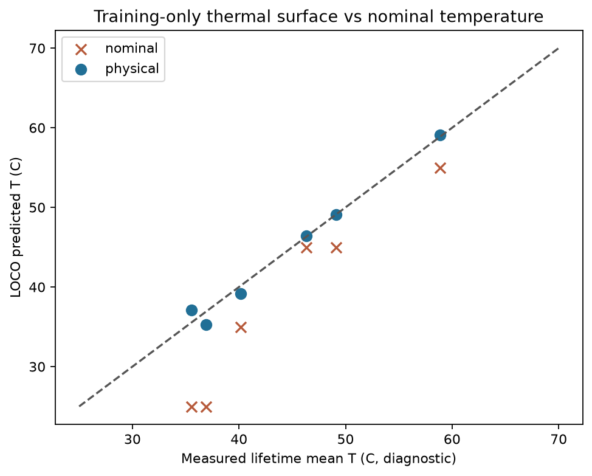
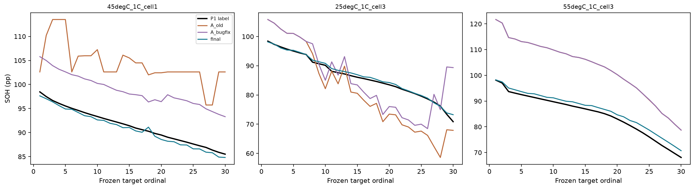
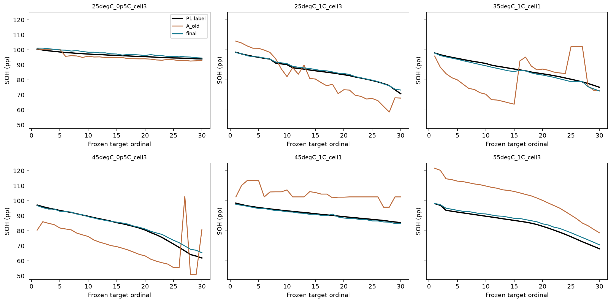
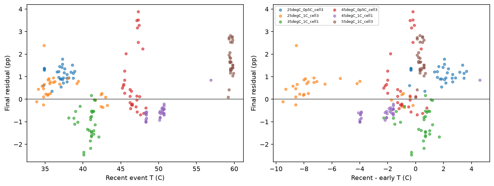
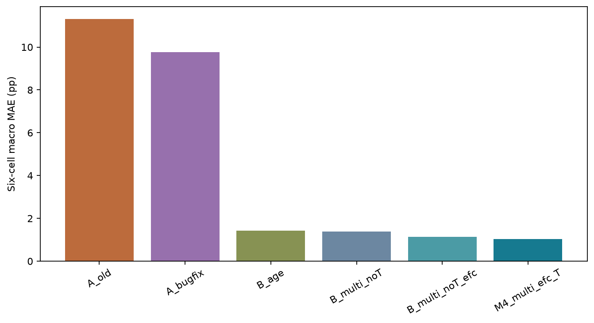
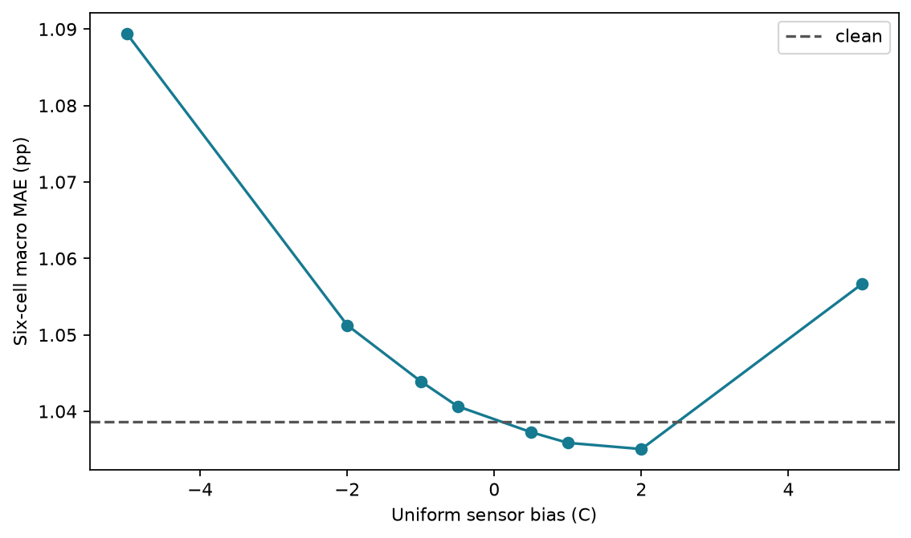
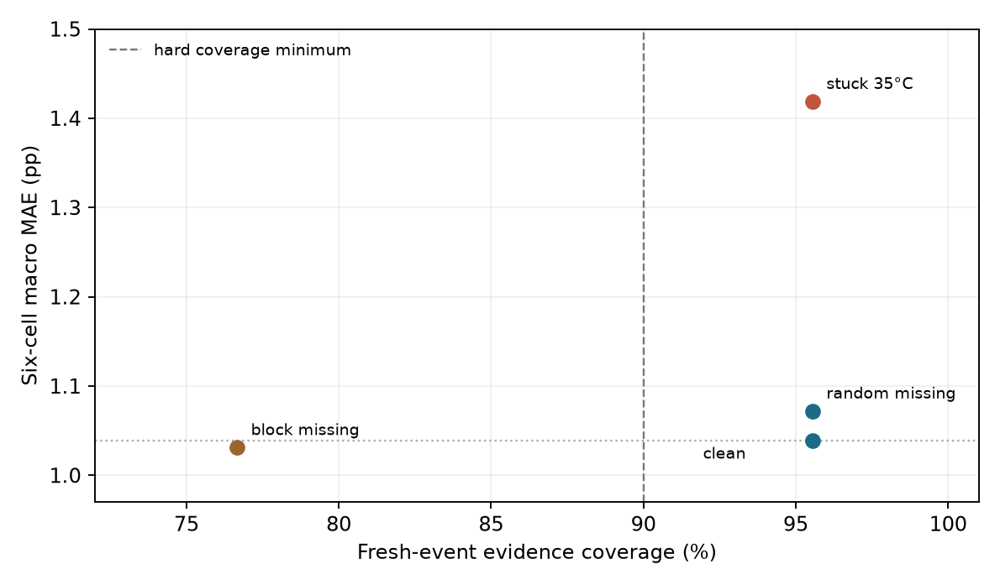
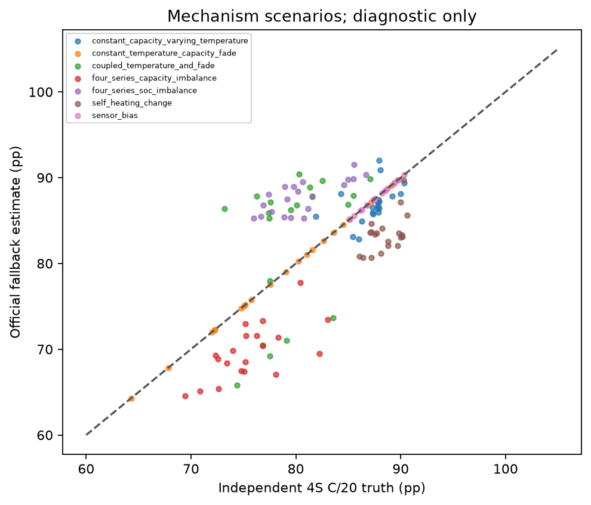

# 方案 A 温度修复与容量映射提升技术报告

版本：2026 年 9 月 28 日。项目：TechArena 2026 Challenge 2 LFP 电池 SOH 第二阶段。本文供项目组评估技术路线、复核实验和决定下一步测量。结论先行：**在六个第一阶段单芯放电容量代理的固定 180 点开发面板上，最终候选达到本任务预设的精度、事件更新覆盖和 ±1°C 传感器偏置硬门槛；对官方四串 C/20 容量的精度尚无真值可验证，而且运行数据与训练数据存在显著充电深度和电压窗口迁移差异。**后一项是实际应用风险，不能用代理面板的 1.039 pp 宏 MAE 替代官方成绩。

## 1 目标、评分对象与信息边界

官方目标是 4 串 102 Ah LFP 电池组在约 5.1 A 放电至组压 11.2 V 时的容量，SOH 分母为 102 Ah。公开 CK0 容量为 100.41 Ah，CK1–CK7 真实容量隐藏。本报告可量化的主验证对象是第一阶段六个物理单芯的 0.5C/1C 放电至 2.5 V 容量，标为 **P1 代理**。两种放电倍率、串数和截止条件不同；P1 误差不是官方隐藏误差。

主面板在模型升级前固定，每芯从公开初始容量锚点之后按有效放电的时间顺序取 5%–95% 寿命位置共 30 点，六芯合计 180 点，SHA256 为 `7188b662900f84312292a7062d6023e5eeb4f2e32798b6d61a3547ed40cdc59c`。每折留出完整物理电芯，训练模型、标准化、温度面和参数选择仅用其余五芯；目标芯在线输入只含预测时刻前已经完成的充电事件和初始公开容量。放电容量标签只进入离线评分，不进入目标推理。评估器保留全部 180 点，包括回退和无事件点；时间上相近的目标不当成独立电芯。

预设的完成线是宏 MAE ≤2.0 pp、宏 RMSE ≤3.0 pp、各芯 MAE ≤4.0 pp、全点 P95 ≤5.0 pp、最大误差 ≤8.0 pp；相对同面板旧 A 的宏 MAE 至少下降 50%，不劣于五个预注册固定基线中最强者；新增有效充电事件的更新覆盖率全体 ≥90%、每芯 ≥80%；目标温度史统一加减 1°C 后的宏 MAE 各增加不超过 0.5 pp、覆盖率各下降不超过 10 个百分点。科学、因果、序列化、官方接口和报告审查另有独立硬门槛。详见 `notes/PROTOCOL.md` 和 `configs/acceptance.json`。

## 2 第一阶段温度模型能解决什么

第一阶段代码用物理温度面把名义箱温度和 C 倍率映射到运行温度：先令 `u=T_nom+k_self×C_rate²`，再以平滑下限 `T_eff=0.5×[u+T_floor+sqrt((u−T_floor)²+sigma²)]` 表达冷却下限及自发热。老化时间尺度采用 Arrhenius 形式；温度面使用摄氏度，Arrhenius 使用开尔文。它的价值是避免把“25°C 箱温”直接当作电芯在高倍率充放电时的真实运行温度。

本轮复现了第一阶段全六芯历史温度面参数 `(T_floor,k_self,sigma)=(35.706051,3.729789,4.489227)`，训练锚点 RMSE 0.455697°C。真正留一芯重拟合时，物理面预测被留出工况的全寿命平均运行温度 RMSE 1.001358°C，而直接使用名义温度为 7.230343°C。这里的被留出全寿命均温只用于温度模型离线评分；它没有回流进任何 SOH 目标芯特征，也不能当作在线可见温度。历史 1B SOH RMSE 1.972 pp 属第一阶段开发记录，原完整复现实验脚本并不齐备，本报告不把它冒充已复现的第二阶段结果。

温度面可作为缺测时的训练折回退和工况外推诊断；其全六芯系数不能直接用于六折主评分。第二阶段事件温度优先取预测前已完成充电窗口的实测中位数，并记录来源、离散度和质量。旧事件配对 146 条中 142 条有可用窗口实测温度，4 条需要训练折温度面回退；窗口温度与整事件温度造成的成对温差差异中位数约 0.3°C。温度修正必要，但单靠它无法解释旧 A 的大容量误差。

图 1 为留芯训练温度面的预测与实测诊断。

## 3 旧方案 A 的故障和修复实验

旧 A 将约 20°C 温度分箱作为配对依据，同箱参考与后期事件实际可能差约 10°C；还在检查质量前登记参考事件，把首次出现的晚期温度层误作接近 CK0 的新锚点。其正电流 ≥5 A 条件不能证明恒流 CC；没有近 30 天事件时又可能返回 CK0，形成不真实回升。三个历史问题有原始窗口和参考记录可查：45°C/1C 参考约 52.3°C 与后期约 62.4°C 配对，25°C/1C 有约 43.1°C 与 33.25°C 配对，55°C/1C 的两个局部 Ah 比值相互矛盾，即使温差较小也无法代表整芯容量比。

M2 把事件质量判断放在参考入库之前，区分 CC 与 CV，禁止积分跨时间缺口或重复采样，按实际温差和电流差匹配，并将参考绑定电芯、窗口、深浅充和时间；晚期新工况参考只能从已有可信估计传播，不能无条件重新锚定 CK0。无新近证据时保持最后可信状态并标记不确定性。最简“仅修旧参考入库顺序”宏 MAE 为 10.735 pp；完整 `A_bugfix` 为 9.755 pp，相对旧 A 的 11.317 pp 改善约 13.8%，仍未达到 M2 的 30% 中间目标。恢复旧 20°C 分箱配对使误差回升至 11.641 pp；以两个窗口分歧作硬拒绝的版本把覆盖压到 55%，宏 MAE 恶化至 14.522 pp。结论是参考污染确实贡献误差，但旧 A 的核心剩余问题是把少数局部 Ah 比值当作整个可放电容量。

图 2 显示三个代表电芯在同一主面板上的旧 A、参考修复与最终方案。它用于定位方法失效，不是只挑好看的单点展示。

## 4 从弱老化先验到多窗口容量映射

M3 首先完整重拟合第一阶段的低自由度温度—老化时间尺度模型，外层每折只给五个训练芯的温度和容量标签；目标芯只有初始公开容量作常数校准，老化坐标来自当前时刻前最后一个已完成充电事件。v1 用历史最大 cycle ID，因部分源数据 cycle 编号与绝对时间不完全一致，在 45°C/0.5C 末期产生约 13.294 pp 最大误差。v2 改用最近完成事件编号，宏 MAE 1.429 pp、P95 4.883 pp，但最大误差仍为 8.095 pp；更重要的是 cycle 编号本身并非新增容量证据，不能计入本任务的窗口更新覆盖率。

M4 转向多窗口监督映射。对每个已完成质量合格事件，在 3.20–3.50 V 内取宽 0.04、0.07、0.10 V 的预定局部 Ah 窗口，共 24 个；同一目标的近期最多五次事件与初期最多十次参考事件形成局部 Ah 对数比及形状摘要。模型另用当前/初期温度、温差、电流差、事件年龄、恒流段 Ah 和从锚点以来合格事件累积充电 Ah/102 作为可移植老化坐标。温度被用作连续协变量及与局部变化的交互，而非 20°C 粗分箱。按物理芯内层留一选择窗口宽度和岭正则系数；外层留出芯不参与选择。拟合目标是相对该芯初始 SOH 的变化，训练侧每芯贡献相同的 30 个固定目标。

为检验温度的边际作用，完全相同的可移植年龄坐标和多窗口结构去掉温度，宏 MAE 为 1.137 pp、最大误差 5.306 pp；加温度后宏 MAE 1.039 pp、最大误差 3.890 pp。另一个预注册固定基线 `B_multi_noT` 使用源 cycle 坐标，宏 MAE 1.384 pp。温度特征在这六芯开发集改善约 0.098 pp，但增益较小；不能凭这一组反复观察过的外层结果宣称温度项具备独立泛化显著性。图 3、图 4 展示六芯曲线和温度残差。

受限曲线对齐作为 M3/T3 竞争诊断，在六个早晚充电曲线配对上同时拟合容量轴伸缩、SOC 起点偏移和电压偏置。局部平台段雅可比条件数约 868–1491，部分尺度参数碰到 1.3 的预设上限；例如 45°C/0.5C 从 cycle 11 到 2205 的曲线尺度只给出约 0.957 的隐含容量比，而训练侧实测容量比约 0.836。曲线形状变化可以被偏移和极化项互相吸收，不具备稳健可辨识性，故不把该对齐值用于最终在线预测。六配对只是训练侧机制诊断，详见 `runs/M3_t3_alignment.csv`。

## 5 固定面板最终结果与不确定性

| 方法 | 宏 MAE pp | 宏 RMSE pp | P95 pp | 最大误差 pp |
| --- | ---: | ---: | ---: | ---: |
| CK0 初始容量常数 B0 | 14.455 | 15.746 | 31.636 | 41.119 |
| 旧 A，同面板重跑 | 11.317 | 12.175 | 22.532 | 36.355 |
| 仅事件/参考修复 A_bugfix | 9.755 | 10.507 | 20.820 | 23.542 |
| B_age v2 | 1.429 | 1.815 | 4.883 | 8.095 |
| 固定多窗口无温度基线 B_multi_noT | 1.384 | 1.532 | 2.893 | 4.706 |
| 可移植充电 Ah 年龄坐标、无温度 | 1.137 | 1.298 | 3.841 | 5.306 |
| **最终候选：可移植充电 Ah 年龄坐标、多窗口、温度** | **1.039** | **1.219** | **2.680** | **3.890** |

表中前五行依次为预先固定的 B0、旧 A、A_bugfix、B_age、B_multi_noT；可移植年龄无温度行是后续配对消融，不替换第五个基线。最终候选六个电芯 MAE 依序为 1.107、0.542、1.097、1.112、0.637、1.737 pp，均低于 4 pp。旧 A 到最终候选的同面板宏 MAE 降幅约 90.82%；六芯均优于旧 A，且优于固定基线中最强的 1.384 pp。对“新增有效事件参与当前容量估计”的严格定义，180 点中 172 点成立，总覆盖 95.56%，最弱电芯 86.67%。事件按物理事件 ID 去重，只计同时出现在当前最近五次局部窗口统计、且在相邻目标之间首次结束并通过质量门控的事件。没有新事件的目标仍评分，不能把年龄坐标推进当窗口更新。

以六个物理芯作整芯有放回 2000 次描述性 bootstrap，最终宏 MAE 的 2.5%–97.5% 区间为 0.745–1.343 pp，旧 A 降幅区间约 84.8%–93.5%。这是小样本开发集上的敏感度描述，不是外部独立样本置信保证；多次查看六折并调整方法，进一步限制了显著性解释。完整逐点值、误差与消融见 `outputs/predictions.csv`、`per_cell_metrics.csv`、`ablation_results.csv`。

## 6 温度扰动、事件缺测和机制仿真

固定干净训练得到的各折系数后，对目标芯截至预测时刻的**全部可见温度史**统一偏移。每个电芯、每个场景均从空的已见事件集合和参考状态开始，按目标时序重新筛选事件、构造初期与近期特征、输出预测和新增事件证据。电流、电压与时间决定的事件边界和 Ah 积分在纯传感器偏置下不变；温度在事件选择和特征构造之前扰动。干净重放宏 MAE 1.039 pp；+1°C 为 1.036 pp，-1°C 为 1.044 pp；两者相对干净的增加远小于 0.5 pp，更新覆盖率均为 95.56%。另以固定特征做 ±0.5、±2、±5°C 的代数等价诊断，不能把它们与硬验收的事件级重放混同。这是传感器读数偏置，不表示环境真实升温；真实升温必须同时改变电压、极化和可用容量。

事件级重放另外检验 +3°C 缓慢漂移、35°C 卡常值、20% 固定种子随机缺测、连续 20% 事件段缺测、温度事件错位。卡常值时宏 MAE 增至 1.419 pp，说明当前有限性门控无法识别所有传感器失真；连续缺测段的新增窗口证据覆盖降至 76.7%，虽然保留下来的老化坐标与局部窗口特征使宏 MAE 未同步恶化。这是**错误自信风险**，不能把低误差解释成缺测鲁棒性已经充分验证。随机缺测、漂移和错位的完整数值见 `runs/M6_event_stress_v1/summary.csv`。图 6 是一致偏置结果；图 7 同时检查误差与新增事件覆盖。

独立机制生成器按四芯 OCV、欧姆降、极化、不可逆容量、温度可逆容量和初始 SOC 计算 5.1 A 放电至组压 11.2 V 的真实组容量；估计器则只看另行生成的充电曲线。每类七个场景各 20 个固定测试种子。60 秒与 30 秒积分步长的最大容量差不到 0.001 Ah，芯编号置换后的最大差低于 1e-12 Ah；另对四芯完全相同、容量不一致、SOC 不一致三类截止情形逐一测试。它验证真值定义和程序性质，不把模拟误差替代实测硬指标。

机制仿真也显示官方降级方法的局限：恒温容量衰减场景的诊断 MAE 约 0.014 pp，但容量不一致和 SOC 不一致场景分别约 5.94 和 7.16 pp，变温叠加衰减约 7.19 pp，自发热改变约 5.12 pp。合成充电曲线主要随已注入容量参数作比例缩放，所以 0.014 pp 的简单衰减结果偏向降级方法假设；这一场景不能强证局部窗口比值在真实 LFP 老化中有效。审计后另冻结四类各 20 种种子的充电曲线扰动：在真实四串 C/20 容量计算不变的条件下，改变后期曲线形状、SOC 所致电压平移、极化和电压噪声，降级分支的诊断 MAE 分别升至 29.48、23.22、10.10、8.75 pp。这是更严厉的构造性敏感性测试，扰动范围并未由真实官方车组校准，不能把这些大误差直接当作实际比赛误差；它明确推翻了“简单衰减仿真几乎零误差即可证明降级分支稳健”的解释。结果见 `runs/M6_curve_variation_v1/summary.csv`。上述数值是所冻结合成参数范围内的机制压力，不是官方真值误差；它们提示四串组端截止不能被单芯容量简单平均或取最小完全替代。

## 7 官方四串迁移与 TU 现场数据

官方 train/test 在独立进程完成，样例 `validate_submission.py` 通过，CK0 输出 98.441%。八个 CK 无标签输出依次为 98.441、97.425、95.828、83.342、78.695、78.622、76.082、80.438%。它们是算法估计，**不能报告 MAE 或准确率**。CK2→CK3 突降约 12.486 pp，CK6→CK7 回升约 4.356 pp；在没有真值和受控温度/放电标定时，均按高风险诊断而不是可靠老化轨迹处理。

迁移失效来源可以实测解释：官方完整数据 41 个质量合格充电事件中多数是约 21 Ah 浅充，而 P1 训练合格事件浅充比例每芯仅约 0.15%–0.60%，几乎全是约 90–100 Ah 深充。官方近期浅充对 24 个局部窗常只覆盖少数窗口；例如 3.38–3.42 V 四芯均覆盖 41/41 次，3.20–3.24 V 仅 8/41 次。候选包对深充完整窗口监督映射设置显式域门控；官方 CK1–CK7 均落入域外，转由同芯、同深度、实际温差/电流配对的无标签局部比值降级分支。该分支的组容量组合规则只是保守的最弱芯比值启发式，未由 11.2 V 截止真值校准；上面的剧烈输出与机制仿真共同说明它不能作为已验证最终精度。每个 CK 的门控原因、四芯比值、更新次数、异常跳变和事件日志见 `outputs/official_diagnostics.csv` 与 `runs/M5_official_candidate/event_diagnostics.csv`。

TU Darmstadt 28 个八串现场系统没有独立容量标签。固定系统 25、1、8 的连续前缀各 100,000 行作流式读取与温度/事件压力诊断；温度传感器在这些前缀中均有记录，按本任务 ≥5 A 的充电事件提取仅检出 0、1、0 个已完成事件。主动均衡和采样间隔/重复时间特性与 P1、官方数据不同，BMS SOC 不能当容量真值。TU 只支撑域外信号诊断，不并入监督训练或 SOH 评分。Che 数据提供部分充电曲线/容量但无对应完整 t/I/V 温度时序，本轮未把它伪装成温度标签或官方四串真值。

## 8 复现、审查与下一步测量

新代码、逐次运行、固定面板、评分器、冻结模型、官方候选与无标签诊断均位于 `research/phase2_temperature_improvement/`。模型包只保留运行所需脚本、预训练系数和官方未改动框架，原始大数据不进入 ZIP，也不向外部平台提交。M7 重算核对原始 P1 文件、标签规则、特征脚本、事件白名单和折内模型的哈希，并在已有因果特征上独立重做矩阵计算与事件覆盖；它是**公式级独立复核**，不是第二套独立编写的原始数据特征提取器或独立重训。交付适配器另从原始时序逐条重放全部 180 个目标，逐点对照冻结预测。科学硬检查包括未来数据任意追加/改动不影响既往 CK、调用顺序/重复查询一致、参考早于截止、折间物理芯不交叠、Ah 积分、事件质量、pickle 新进程、官方接口和合成真值积分。最终审查结论、Word 逐页排版检查和文件哈希单独记录在 `notes/FINAL_AUDIT.md`、`outputs/M7_independent_recompute.json`、`outputs/acceptance.json`；后者由评分器生成，不由模型直接填写通过状态。

最有价值的新增测量，是**在官方相同四串上公开至少若干跨 25/45°C 切换、在统一 5.1 A 至 11.2 V 截止协议下的容量标签，并同时保留每芯电压、温度与均衡电流**。其优先级高于继续在六个 P1 芯上调低几个百分点：它可以直接检验温度效应、浅充窗口到组容量的映射、最弱芯截止规则与当前 CK 大幅跳变的真实性。若只能做一项，先获取跨温度切换前后的成对四串 C/20 复测；再增加覆盖官方 21 Ah 浅充模式的有标签训练芯，按全新物理系统冻结后验证。未有这些数据时，项目可以交付一个在 P1 代理上可复现、精度明显改善的技术路线，但不能声称已解决官方隐藏标签任务。

## 参考与证据索引

1. 第一阶段源码：`/Users/shane/Desktop/项目/Current State_Challenge1/my_model/model_template.py` 与 `pretrained.json`；第一阶段 `README.md`。物理温度面和老化先验按训练折重拟合，历史开发数字明确区分。
2. 官方 `README.md`、`submission_instructions_2026.md`、`data/DATA_DESCRIPTION.md`、`framework/data.py` 和 `CHALLENGE2_DESCRIPTION.pdf`，项目根目录；四串目标、公开 CK0 和接口依据。
3. 上一轮两方案研究：`research/phase2_validation/outputs/LFP_SOH_双方案设计验证与比较报告.md`、`notes/FINAL_AUDIT.md`、`outputs/a_failure_review/selected_event_references.csv`；旧 A 问题与核验素材。
4. 本轮原始面板、模型和评分器：`outputs/panel_main.csv`、`outputs/predictions.csv`、`outputs/evidence_events.csv`、`scripts/check_acceptance.py`、`runs/M4_multi_efc_T_v1/fold_models.json`、`runs/M6_mechanism_v1/results.csv`。
5. 文献证据卡和综述：`research/phase2_literature/notes/EVIDENCE_CARDS.md`、`outputs/LFP_SOH_第二阶段文献综述与技术路线.md`；Deng 2022 的多特征局部容量映射、Che 2023 的部分充电曲线迁移和受限曲线对齐只作方法启发，本文误差均来自本项目重跑。
