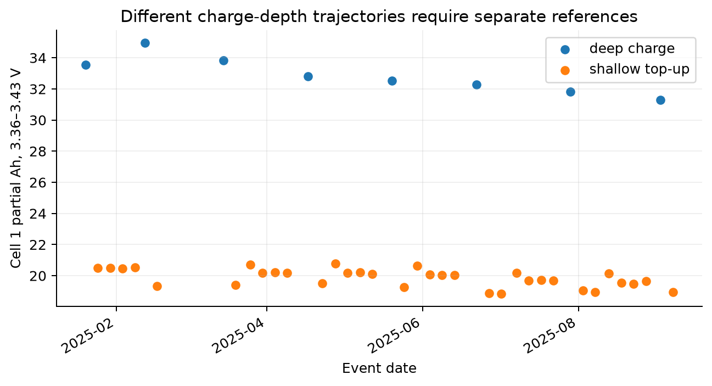
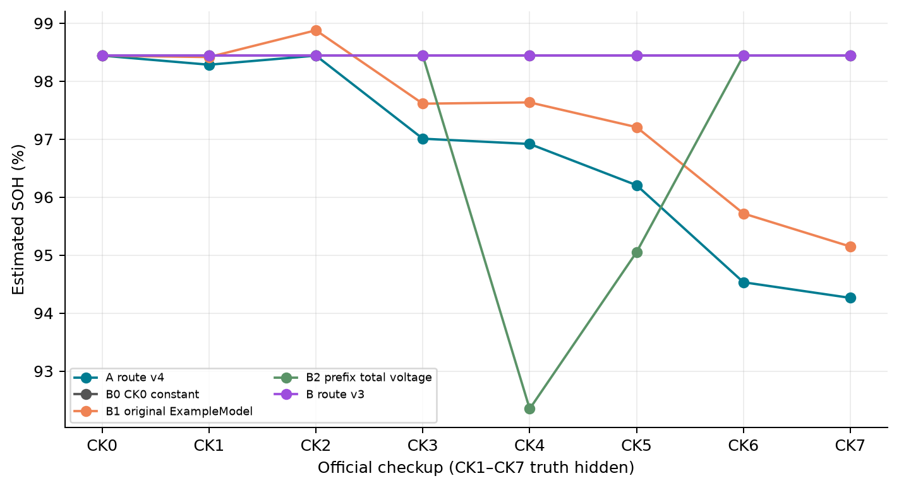
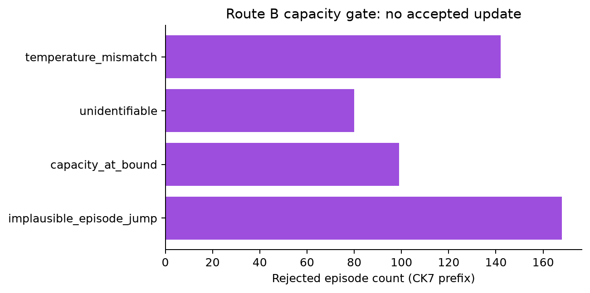
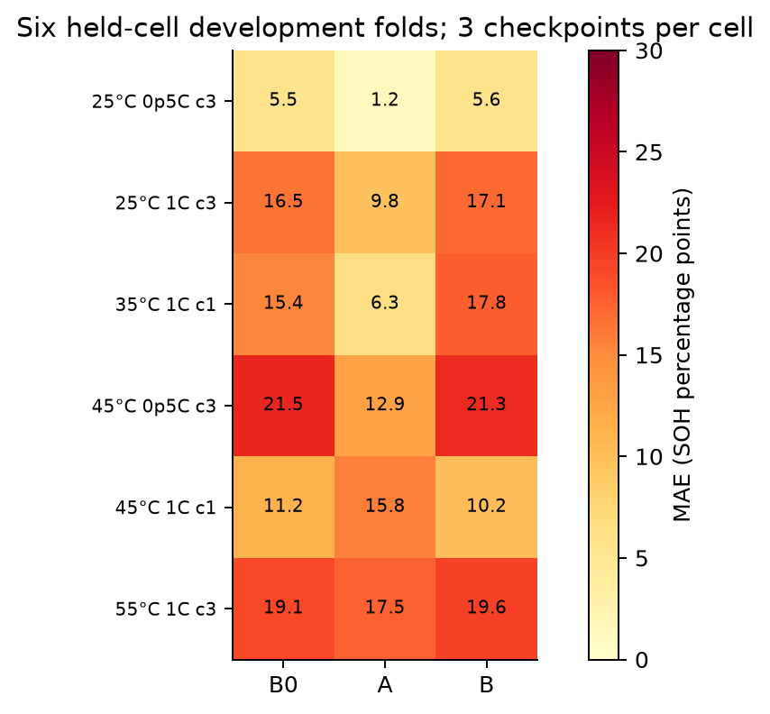
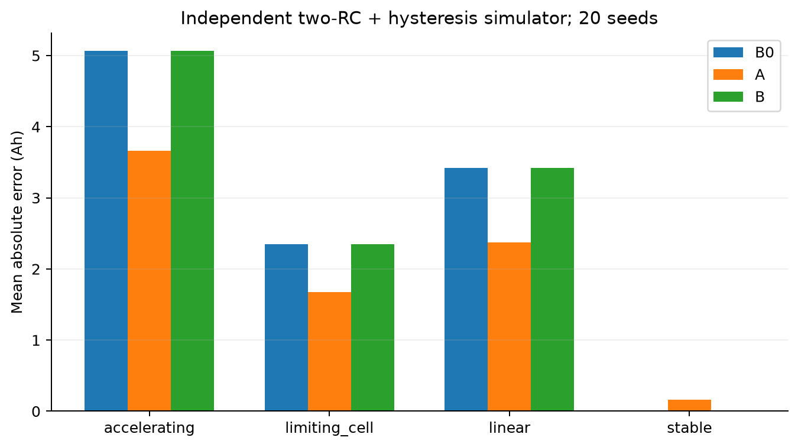
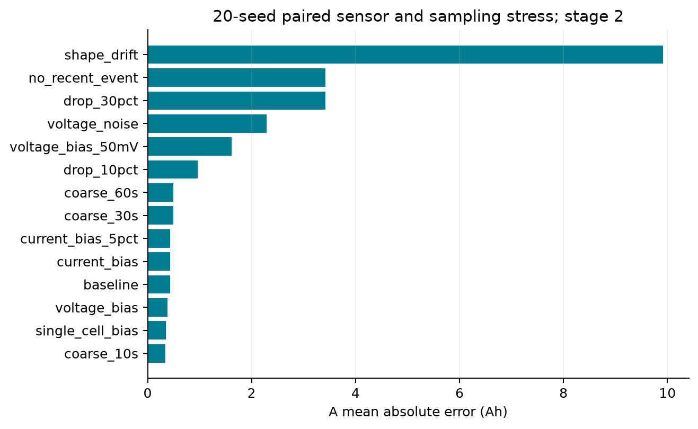

# LFP 电池 SOH 第二阶段双方案设计验证与比较报告

2026 年 9 月 28 日  |  技术研究报告  |  面向项目组方案评审

## 执行摘要

本研究实际实现并运行了两条独立候选：路线 A 从同一单体、相同电压窗口及相近充电工况的局部 Ah 比值估计容量；路线 B 用 CK0 放电曲线约束低阶 SOC、极化和容量的联合估计，并在信息不足时冻结容量。两个候选都通过官方样例验证器、完整官方数据的 train 和八个检查点 test，以及跨进程序列化和未来数据扰动测试。官方只发布 CK0 容量 100.41 Ah；CK1–CK7 容量保持盲测，因此本文不报告官方隐藏点的容量误差。

当前证据支持把 A 作为**有条件的首选研究候选**，继续核查事件并争取四串真实容量验证。第一阶段六个单芯的 18 个检查前预测中，A 的平均绝对误差为 10.57 个 SOH 百分点，初始容量常数为 14.86，B 为 15.27。A 对 B 的六芯配对误差差为 -4.69 pp，按芯重采样的描述性区间为 -8.89 至 +0.15 pp；仅有六芯且它们曾用于旧阶段开发，不能宣称显著性或独立盲测获胜。该实测目标是单芯约 0.5C 或 1C 放电到 2.5 V，绝非官方四串 5.1 A 放电到组压 11.2 V。

B 是已实现的**保守备选与可辨识性诊断**，当前不能作为已验证的容量追踪器。它在解析高斜率正例中恢复已知容量，在平坦平台正例中拒绝更新；在官方真实运行八点中零次容量更新，输出始终为 CK0。去掉门控后，独立失配仿真的误差从约 3.42 Ah 增至约 21.80 Ah。下一步不是盲目加复杂滤波器，而是补充真实 OCV 端点、低电流静置或足够高斜率且工况可控的充电证据。

## 一 项目任务与证据边界

官方目标是 4 串、名义 102 Ah 的 LFP 组，在约 5.1 A 即 C/20 放电至组压 11.2 V 时可用容量，SOH 分母为 102 Ah。CK0 释放容量 100.41 Ah，精确换算为 98.441176%；文件显示 98.44% 是四舍五入。运行记录有 13 个片段、1,572,894 行、通常 10 s 采样，缺片段 03。预检发现 181 个重复时间戳和 3 个片段内部超过 60 s 的缺口；时间、月检吞吐量及累积 Ah 都不能被误当连续的完整 SOC 观测。

证据等级分开使用：E0 为接口、数学、因果和序列化；E1 为官方无标签运行与 TU 现场诊断；E2 为独立求得容量目标的模拟机制试验；E3-P1 为第一阶段实测单芯放电容量代理；E3-Che 为同次充电部分 Q 与充电容量补充；E4 官方 CK1–CK7 隐藏真值目前不可得。本文不把 E1 曲线平滑或 E2 仿真小误差转换成 E4 精度结论。

| 数据 | 独立单位与规模 | 可用容量目标 | 本轮用途与限制 |
| --- | --- | --- | --- |
| 第二阶段官方 | 1 个四串组；157 万运行行 | 仅 CK0 100.41 Ah | 八点前缀诊断；CK1–CK7 真值隐藏 |
| 第一阶段官方原始包 | 6 个单芯；860 万行；旧规则有效标签 19,292 个 | 0.5C 或 1C 放电至 2.5 V | 六芯留出开发比较；不能替代 C/20 组目标 |
| Che Dataset 3 | 11 个单芯；23,853 个容量循环 | 全充电过程记录的充电容量 | 同次充电部分 Q 形状；本地 MAT 无原始 t、I、V |
| TU Darmstadt | 28 个八串系统；1.328 亿行 | 没有实测容量列 | 系统 25、1、8 的现场信号质量；BMS SOC 不等于 SOH |

数据验收、许可和本地 SHA256 登记分别在 `DATA_ACCEPTANCE.md`、`SOURCES_AND_PROTOCOLS.md`、`preflight/downloaded_data/audit_report.json`。第一阶段材料按比赛许可在本地复用；Che 为 CC BY 4.0，TU 为 CC BY-NC 4.0，不向外重分发原始数据。

## 二 事先固定的验证协议

`notes/PROTOCOL.md` 在 A/B 误差结果出现前冻结初始窗口、门控、失败规则、固定随机种子 20260928 和证据层级。所有官方检查点只使用 `timestamp <= 当日 00:00` 的运行行；CK0 放电参考是官方明确允许的额外信息。两个候选的 `fit` 只保存 CK0 与静态参考，不以全周期运行行计算归一化量；每次 `estimate_soh` 重新截取当前前缀。已完成事件才进入计算，重复时间步、超过 60 s 的断点、不同片段或非正充电电流不能跨越积分。

第一阶段外层按完整物理电芯目录六折留一；其余五芯在当前无监督主版没有被用来拟合参数。每个留出芯只向模型开放首个合格放电容量和该次高倍率放电曲线，后续 `cc_discharge` 全段与 `step_capacity_Ah` 对模型不可见。目标在对应放电开始前预测，按绝对时间选择已完成的先前充电，允许输入和标签分属不同循环编号。为避免相邻采样点制造虚假的样本量，每芯固定早、中、晚各一个目标，共 18 个目标、6 个独立电芯。个别循环的绝对时间与别的循环交叠，按来源循环保持事件隔离，并对输入结束早于目标开始作断言。第一阶段原始行常倒序，统一稳定按绝对时间排序。

标签侧先按物理芯及 `cycle_number` 对 `cc_discharge` 行取 `step_capacity_Ah` 最大值作为放电容量 Q，计算 `SOH_pp = 100 × Q / 102`，而非对可见充电段积分。沿用第一阶段旧评分器的有效标签过滤：`0 ≤ Q ≤ 1.15 × 102` 且 `Q ≥ 0.6 × m`；其中 m 优先为前序容量的 15 次滚动中位数（至少 3 次），缺失时用当前附近 9 次居中滚动中位数。每芯按放电开始时刻选首个合格循环作锚点，后续合格循环按索引 10%、50%、90% 分位选三目标。六芯锚点循环、目标循环号和各目标放电开始时间逐条见 `outputs/phase1_folds.json` 与 `outputs/phase1_crossvalidation_predictions.csv`；原始目标容量和所有预测值同在后者，故 18 点误差可逐行复算。这个筛选只用于标签侧和锚点，不把未来标签送入估计器。

六芯在项目旧阶段已经用于开发，所以此评估称“留电芯开发验证”。首轮 A/B 失败后根据观察作了明确标记的质量修复，并在相同六芯上重新评估；修复后的 10.57 与 15.27 pp 是再使用开发集结果，不能称新盲测。原失败预测保留在 `runs/A_official/`、`runs/phase1_sixfold_v1/`，没有被覆盖或删除。

## 三 路线 A 的设计与实际实现

A 在每个已完成且连续的正电流事件中，按单体电压首次向上穿越窗口下界与上界的相邻采样做线性插值，用电流及真实秒数积分得到两交点之间的 Ah。初版窗口是 3.33–3.40 V 和 3.36–3.43 V；每段至少 10 个采样、60 s、15 Ah 总充电且目标窗局部 Ah 至少 1 Ah。窗口单位是单芯 V，不把四个串联电芯的读数当四份独立绝对容量。充电方向电流为正，Ah 积分除以 3600。可选用官方累计充电 Ah 进行交叉对照，但计数器重置或缺失时不能静默替代积分。

参考选择是每一单芯、窗口、温度层、深浅充电类型的首个合格事件。深充电定义为整段充入 Ah ≥50，浅补电为 <50；温度层用 `round(事件温度中位数 / 20)`，候选事件还须距离该层中心 ≤7°C，且其充电电流中位数与参考之差不超过参考电流的 20%。在当前截止前最近 30 天内取最多 5 个已完成事件；先汇总同一次事件中所有可用单芯与窗口的比值，再对近期事件取中位数。第一阶段单芯适配时仅有一个电压列，沿用两个单芯窗口和同样的事件聚合，绝不假造四个观测。官方 CK7 有 1,016 段宽口径连续充电、23 个已建立的单芯/窗口/工况参考键、24 个匹配窗口观测及 5 个近期事件更新；各 CK 有效数在 `runs/official_diagnostics.csv`。估计容量等于锚点容量乘这些局部 Ah 比值的中位数，再除以名义 102 Ah 得 SOH。无有效比值或事件过期时输出 CK0 并标记回退。不同温度层的首事件不是新的容量真值；其相对 CK0 的偏移是系统不确定性。

首版曾把 CK0 后约 100 Ah 的深循环充电和后续约 21 Ah 的日常补电共用同一窗口参考，使 CK1 估成约 60%。原始事件显示两种轨迹的单芯 3.36–3.43 V 局部 Ah 约 34 与 20 Ah，不能直接相除。按深浅充电分层是基于 E1 原始事件的物理质量修复，首轮错误作为失败案例保留。最终官方模型 `candidates/route_a/` 默认参数经过此修复。单芯第一阶段所有充电基本为全循环，这个分层消融没有带来差别，说明它是**协议相关**的必要条件。

## 四 路线 B 的设计与实际实现

B 用 CK0 的 70,876 个**约 1 s 采样点**构造随 SOC 单调的准 OCV 形状，并压缩至 201 个 SOC 结点。该独立放电参考从 2025-01-15 14:03:42 到次日 09:44:56，约 19.7 h；上文的通常 10 s 采样专指运行片段，且参考表每行同时记录四个单芯电压，并未将四芯展平为 70,876 × 4 行。因为原曲线在负载下测得，它仍含极化和滞后；模型给其约 30 mV 的形状不确定度，不能称真实平衡 OCV。直接在原始毫伏量化的 70,876 行上微分会产生大量假零斜率，故先插值至 SOC 网格再计算斜率。初始容量以 100.41 Ah 锚定。

每次完整充电事件内，SOC 随正充电电流按 I × Δt ÷ (3600 × Q) 增加。端电压表示为准 OCV 加瞬时欧姆项与一阶极化项；极化按 300 s 时间常数衰减并受当前电流驱动。事件内约 45 个等距原始采样用于带边界的最小二乘，拟合初始 SOC 与容量 Q。固定电压偏置从首点差分中消去。多初始 SOC 起点避免只落在一个局部极小值，容量强制在 40–125 Ah 数值边界内，但贴近 42/123 Ah 边界的结果不接受。

具体采用 `z_k = z_0 + q_k/Q`，`v_k = OCV(z_k) + 0.0015 Ω × I_k + v_{p,k} + b`，`v_{p,k} = exp(-Δt/300 s) v_{p,k-1} + [1-exp(-Δt/300 s)] × 0.002 Ω × I_k`，初始极化取 `0.002 Ω × I_0`。四芯电压在每时点取中位数，固定 b 经首点差分消去；最小二乘残差按 0.03 V 缩放。初始 `z_0` 从 0.03、0.20、0.45、0.65 多点试起，搜索 `0 ≤ z_0 ≤ 0.96`、`40 ≤ Q ≤ 125 Ah`，以残差加轻度偏离先验罚项选解。这些数值是受约束识别设计而非从隐藏容量拟合，完整实现见 `candidates/route_b/my_model/model_route_b.py`。

容量更新还要求单事件正向 Ah 激励至少 5 Ah、SOC 处准 OCV 斜率中位绝对值至少 0.4 V/SOC、按 30 mV 噪声和无量纲 SOC/对数容量尺度归一化的二参数雅可比最小奇异值至少 0.05、扣除偏置后的电压 RMSE 不超过 0.08 V，且拟合容量与先验差不超过 10%。合格事件以 20% 权重更新 Q；否则冻结。月检缺失通量或长缺口后，下一事件重新拟合初始 SOC，不假装连续库仑计量。当前实现是**逐事件低阶 ECM 约束优化**，不是全时段 EKF；容量 Q 作为组可用容量的近似，其与实际 C/20 组端截止容量间的映射尚需真实组实验验证。

数值正例在高斜率且无模型失配时从 100 Ah 初值恢复 95 Ah，归一化最小奇异值约 1.44；相同电压拟合精度的平坦平台例最小奇异值约 0.00028，门控拒绝。这证明门控确实响应信息量而不是仅响应电压残差；它不证明真实运行容量可辨。真实六芯首版曾反复把 Q 推到 40 Ah 下界，修复量化斜率及边界/单事件跳变门控后，官方运行中的容量更新仍为零。这个失败在备选路线结论中保留。

## 五 基线和工程正确性

官方 E1 同时计算 B0 初始容量常数、B1 未修改的原版 ExampleModel、B2 严格前缀的总压局部 Ah、A 和 B。B1 的训练入口可读全周期运行，当前首参考恰好取早期片段；它保留为原始规则的工程对照，不暗改。B2 在每个前缀选首个同温度及深浅类型的总压 13.4–13.95 V 参考，而非从未来拟合参考。第一阶段单芯不把原版四串 13.4 V 阈值直接用于 3 V 单芯；专门适配的 B2 单芯局部窗口基线单列报告。

E0 测试共 12 项，覆盖积分秒数与电流符号、阈值插值、重复时间和缺口、不完整事件、空前缀/NaN/缺单芯、计数器重置、追加极端未来行的预测一致性、`fit(full)` 对 `fit(prefix)`、乱序调用、pickle 跨进程，以及高斜率/低斜率可辨识正反例。两套样例 validator 通过，完整官方 `train` 和 `--eval-point all` 均成功输出八行；A 本机全点 test 约 12 s，B 约 23 s，均低于本机 validator 的短时限。它们不是官方 Linux 评分机耗时。官方入口、框架与原始数据保持哈希一致，候选各自有独立 `my_model/` 与依赖。

## 六 官方四串无标签运行诊断

以下为 SOH 估计值百分数，**CK1–CK7 均无真值**，不能据此算 MAE 或宣称某轨迹更准。完整逐条结果、估计 Ah、回退和事件数见 `outputs/predictions_official.csv` 与 `runs/official_diagnostics.csv`。

| 检查点 | B0 常数 | B1 原版 | B2 前缀总压 | A 单体窗口 | B 门控容量 |
| --- | ---: | ---: | ---: | ---: | ---: |
| CK0 | 98.44 | 98.44 | 98.44 | 98.44 | 98.44 |
| CK1 | 98.44 | 98.42 | 98.44 | 98.28 | 98.44 |
| CK2 | 98.44 | 98.88 | 98.44 | 98.44 | 98.44 |
| CK3 | 98.44 | 97.61 | 98.44 | 97.01 | 98.44 |
| CK4 | 98.44 | 97.63 | 92.35 | 96.92 | 98.44 |
| CK5 | 98.44 | 97.21 | 95.05 | 96.21 | 98.44 |
| CK6 | 98.44 | 95.72 | 98.44 | 94.53 | 98.44 |
| CK7 | 98.44 | 95.15 | 98.44 | 94.26 | 98.44 |

A 在 CK2 因最近 30 天内没有可和已建参考配对的合格事件，主动回退为 CK0；这不是“容量恢复”。B 到 CK7 前缀共有 1,016 个宽口径连续充电事件，其中 527 个不足 5 Ah 而未拟合、142 个因温度不匹配在拟合前拒绝，余下 347 个进入容量拟合；168 个因单事件容量跃迁 >10% 拒绝、99 个触及 42/123 Ah 边界、80 个信息不足，接受数为零。另有 5 次大于 7 天的缺口标志，它可与拟合拒绝同时发生，不应重复计入漏斗。CK1–CK7 的累计和新增计数见 `outputs/route_b_rejection_funnel.csv`，B 所有后续检查点均为 CK0 回退。B2 覆盖也低且在 CK4 出现 92.35% 的孤立偏低估计，说明总压门槛并非可靠的质量证据。A 的渐降与 B1 的渐降仅是方法输出一致性，不能推断隐藏真值。

## 七 第一阶段六芯实测代理比较

本节采用真实电芯测得的 0.5C 或 1C CC 放电容量，且每一预测发生在目标放电开始前。六个物理芯各早中晚 3 个目标，所有目标包括回退都计分。单芯高倍率参考曲线不是平衡 OCV，B 已增大准 OCV 不确定度。SOH 误差单位 pp；每芯恰有 3 个目标，因此此处宏平均与 18 点微平均数值相同。

| 方法 | 18 点 MAE pp | RMSE pp | 最大绝对误差 pp | 回退率 |
| --- | ---: | ---: | ---: | ---: |
| B0 初始容量常数 | 14.86 | 17.90 | 39.22 | 100% |
| B2 单芯窗口适配基线 | 13.80 | 17.13 | 37.75 | 5.6% |
| A 同芯双窗口 | 10.57 | 12.51 | 21.51 | 5.6% |
| B 门控低阶模型 | 15.27 | 18.40 | 37.22 | 27.8% |

| 留出电芯工况 | B0 MAE pp | A MAE pp | B MAE pp |
| --- | ---: | ---: | ---: |
| 25°C 0.5C cell3 | 5.47 | 1.22 | 5.59 |
| 25°C 1C cell3 | 16.47 | 9.80 | 17.08 |
| 35°C 1C cell1 | 15.43 | 6.26 | 17.81 |
| 45°C 0.5C cell3 | 21.52 | 12.89 | 21.30 |
| 45°C 1C cell1 | 11.19 | 15.79 | 10.16 |
| 55°C 1C cell3 | 19.10 | 17.47 | 19.64 |

A 在五个芯上优于 B0，在 45°C/1C cell1 上更差。对 A-B 的六芯平均绝对误差配对差为 -4.69 pp，2000 次按整芯 bootstrap 的 2.5%–97.5% 分位为 -8.89 至 +0.15 pp；小样本仅表达方向不稳定，不作显著性证明。A-B0 差为 -4.29 pp，但同样是开发集且修复后再使用。B 的第一版 18 点 MAE 为 25.47 pp，主要由不可信的 40 Ah 边界更新造成；物理门控修复后降至 15.27 pp 但仍未超过常数，说明安全修复不等于容量辨识成功。

## 八 独立模拟容量机制与压力测试

E2 使用 20 个独立种子（100–119）、四种老化机制：健康不变、线性老化、加速老化、单个限制芯加速衰减。在限制芯机制中，20 种子有 16 个从阶段 0 到阶段 3 的最低容量单芯发生切换。生成器包含四芯非线性 OCV、两个 RC 极化时标（90/800 s）、充放电滞后（约 7 mV）和噪声（约 1 mV），结构与 B 的单 RC 模型不同。运行充电为 20 A、初始 SOC 0.60、阶段间隔 30 天且温度 25/45°C 交替；线性机制每阶段每芯减 1.8 Ah，具体种子与四机制参数及阶段索引见 `scripts/run_synthetic.py` 和 `runs/E2_twoRC_hysteresis_20seeds/config.json`。真实目标从每一阶段的独立 5.1 A 放电轨迹计算到组压 11.2 V；模型只拿到 CK0 曲线与此前运行事件，不能读取生成器容量参数。各机制 3 个后续阶段 × 20 种子，共每方法 240 个已知容量目标；所有模拟数值只代表机制检验。

| 机制 | B0 MAE Ah | A MAE Ah | B MAE Ah |
| --- | ---: | ---: | ---: |
| 健康不变 | 0.00 | 0.16 | 0.00 |
| 线性老化 | 3.42 | 2.37 | 3.42 |
| 加速老化 | 5.06 | 3.66 | 5.06 |
| 单个限制芯 | 2.35 | 1.68 | 2.35 |

A 在这些受控机制里能获得局部 Ah 信号，但有效更新覆盖有限，跨温度首参考与窗口不重叠导致约三分之二目标回退。B 在该独立失配生成条件下全部回退；这不是零误差，只是避免在模型不符时强行更新。

压力测试固定为线性老化**阶段 2**的 20 种子配对比较，因此 A 基线 MAE 0.44 Ah 不等于上表跨阶段 1–3 的 2.37 Ah；该场景 B0/B 全回退 3.42 Ah 恰好与上表跨阶段均值四舍五入相同。A 的 10/20/30/60 s 采样分别为 0.34/0.44/0.50/0.50 Ah；额外电压噪声为 2.29 Ah，10%/30% 随机丢样分别为 0.97/3.42 Ah，删掉最近事件为 3.42 Ah、充电 OCV 形状漂移达 9.92 Ah。+10/+50 mV 整组电压偏置分别为 0.38/1.61 Ah；单芯 +50 mV 是 0.36 Ah。额外 +0.2 A 与 +1.0 A 测量电流偏差在所用首参考比值中相互抵消，不能据此说 A 普遍不怕电流偏差。B 基本回退；丢样变体的偶然偏差改善不能算鲁棒性成功。所有扰动参数与逐种子结果见 `outputs/stress_results.csv`。

## 九 消融解释

E2 的 20 种子**线性老化阶段 2**固定场景里，A 换成总压单窗口、去温流匹配、计数器替代积分、均值替代中位、去深浅分层与加单体分歧门控均实际运行，逐种子记录在 `outputs/ablation_results.csv`。在单一温度/相似电流的 E2 场景，匹配开关和深浅分层自然没有影响，不能解释为这些模块对官方数据无用。计数器与积分的 E2 结果相同，是因为模拟计数器没有漂移。B 的固定 Q、无门控、无偏置控制、无缺口重初始化及准 OCV 不确定度敏感性也有实际结果；去门控使该阶段 MAE 由 3.42 Ah 增至 21.80 Ah，验证了识别约束的安全价值。

在同一六芯开发集作 A 组件再分析，默认 10.57 pp、均值聚合 10.41、去温流匹配 9.29、单体分歧门控 11.23、单窗口 B2 13.80。由于这些数字在已查看六芯误差后取得，不能按最小测试误差立即改正式候选。去匹配看似提升可能反映单芯高倍率实验的温度层变化小，与官方 25/45°C 交替工况不同；需要新芯或组数据重验。深浅分层在第一阶段全充电协议下无差别，但官方真实事件已明确证明跨深浅参考会造成假降幅。

## 十 Che 与 TU 的补充证据

Che Dataset 3 本地 MAT 有 11 芯、23,853 次容量记录、每次 101 点 `Partial_Q` 和 `Partial_dQ`。发布页说明容量为全充电过程的充电 Ah；论文描述 LFP 插值常用 3.3–3.5 V、2 mV 间隔，101 点与之相符，但此 MAT 并未把显式电压网格、逐时 t/I/V 保存为可核验字段。本文只把末端部分 Q 与首次之比作为**同次充电诊断**，在每芯 10%、50%、90% 循环位置共 33 点与首次归一化充电容量比较，平均绝对差 5.89 pp。两者共享同一次充电过程，不能当独立前向容量预测，也不能把充电容量重命名为官方 C/20 放电容量。B 所需时序无从构造。

TU 文件的发布者说明包含 28 个约 160 Ah 八串 LFP 系统、有主动均衡、样本是被退回厂家而非总体随机抽样。本轮按预先指定的系统 25、1、8，各取早、中、晚连续索引窗口约 10 万行，共 90 万行深入检查；为定位窗口对三个文件作分块顺序读取，未把 18.5 GiB 全部拼入内存。系统 25 的组压减八芯和绝对残差 95 分位早期约 0.009 V、晚期 0.181 V；系统 1 晚期约 0.671 V，不能把组压与芯压和当恒等式强行用于容量反演。系统 8 早期窗口多数采样间隔约 61 s，若沿用 60 s 事件连续门槛会大量拒绝；系统 1 中期有大量重复/不规则时间。不同窗口存在均衡电流活动，串联组电流不能直接视为每芯相同有效充电电流。`SOC_Battery` 只作 BMS SOC 诊断，无真实 SOH 标签，因而不报告 TU 容量 MAE。

## 十一 条件化路线选择与尚缺证据

若任务必须现在输出一个可解释研究候选，选择 A，并始终携带事件数、最近有效事件时间、温度/电流匹配、深浅充电类型和回退标志。A 有真实单芯代理上的平均误差收益，也有明确的曲线漂移与数据缺失失败边界。B 保留为可辨识性审核：在平台区、温度失配或边界解时冻结容量是合理的工程行为，但官方八点全冻结使它不能承担独立 SOH 更新职责。原版 B1 可作运行一致性参照，不因其曲线平滑就作为精度赢家。

最关键的未验证事项是**真实四串 C/20 组端容量**。需要保存检查点前的完整运行前缀、5.1 A 到 11.2 V 的实际 Ah、测试温度、组端及单体截止规则，并以从未用于本轮调参的电池组作留组测试。对 A 还需跨 25/45°C 的重复深浅充电确认参考层；对 B 需静置/低电流 OCV 或可独立约束极化与 SOC 端点的数据。CK1–CK7 隐藏不是待下载的普通文件，本任务未进行比赛外部提交或借反馈反演真值。

## 十二 复现入口与参考资料

根目录官方文件未经修改。两套独立代码在 `candidates/route_a/`、`candidates/route_b/`；测试在 `tests/`，原始逐条预测在 `outputs/phase1_crossvalidation_predictions.csv`、`outputs/predictions_official.csv` 和 `runs/E2_twoRC_hysteresis_20seeds/predictions.csv`；统计、消融、压力、Che、TU 各有同名 CSV。版本化命令、环境、输入哈希、失败首轮保留位置及 Word 渲染方法见 `REPRODUCE.md` 与 `notes/FINAL_AUDIT.md`。

主要资料：[第二阶段官方题目](../../CHALLENGE2_DESCRIPTION.pdf)、[第一阶段官方原始包](../../dataset%20original/TechArena_2026_Topic_1_Challenge1.pdf)、[Che Dataset 3 发布页](https://data.mendeley.com/datasets/n3b54nsw8m/9)、[Che 等论文全文](https://pangea.stanford.edu/ERE/pdf/OnoriPDF/Journals/75.pdf)、[TU Darmstadt Zenodo 发布页](https://zenodo.org/records/13715694)、项目内既有 `research/phase2_literature/outputs/LFP_SOH_第二阶段文献综述与技术路线.md`。Che 发布页关于充电容量语义与论文关于 LFP 部分 Q 插值窗口是具体来源；没有据此补造本地 MAT 缺失的时序字段。
