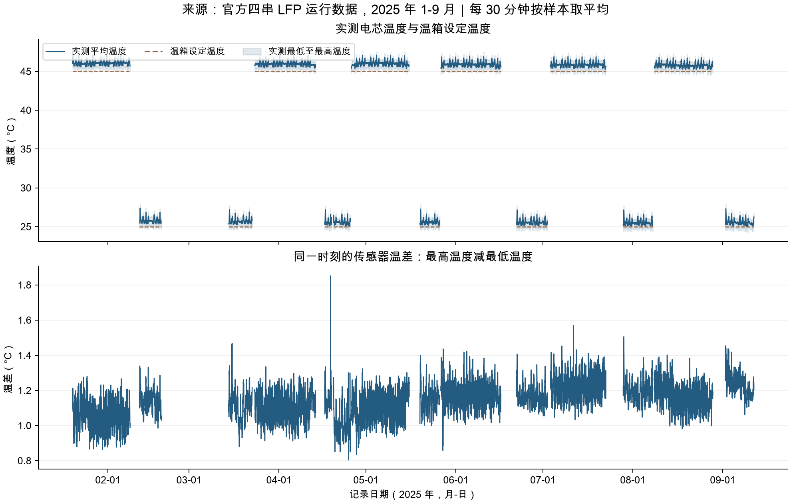
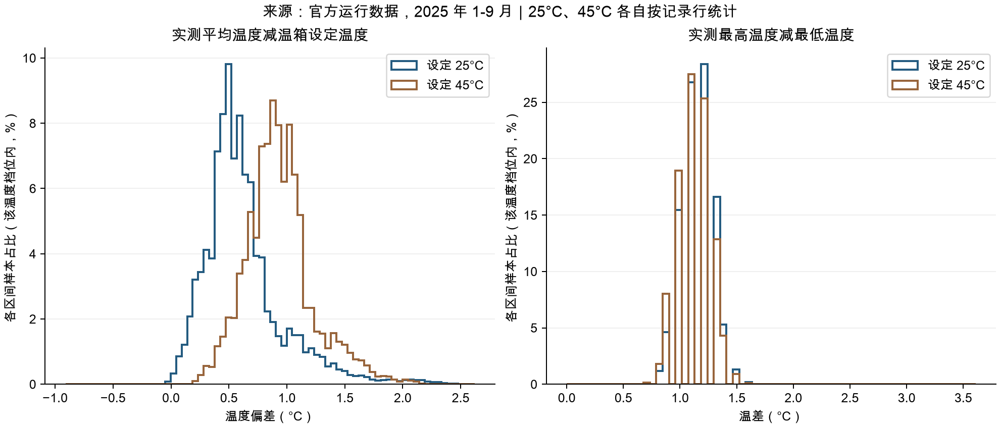
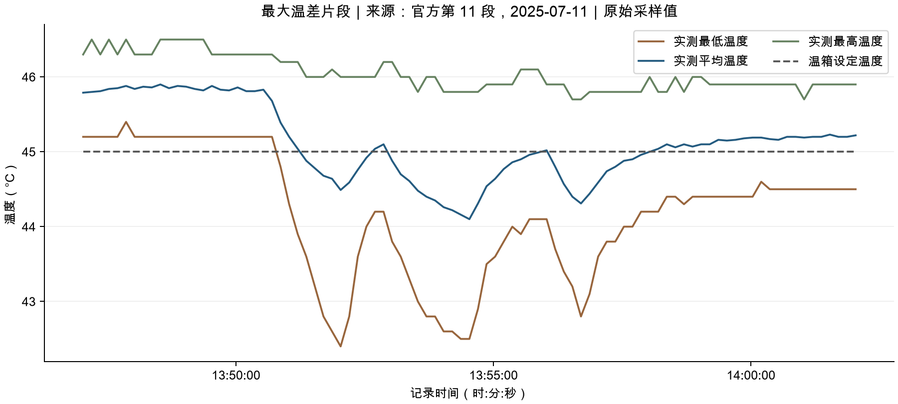

# 官方温度数据分析总结

分析日期：2026 年 10 月 6 日。数据来源：官方 `data/operation/` 全部 13 个运行文件，合计 **1,572,894 行**，覆盖 2025-01-19 19:10:56 至 2025-09-11 18:07:11。本次没有修改原始数据或正式模型。

## 先看结论

1. **温箱设定温度与实测平均温度不同。** 25°C 档实测平均为 **25.63°C**，平均高出 **0.63°C**；45°C 档实测平均为 **45.94°C**，平均高出 **0.94°C**。
2. **同一时刻不同传感器之间存在约 1.14°C 的平均温差。** 全部记录中，平均温度比最低温度高约 **0.66°C**，最高温度比平均温度高约 **0.48°C**。
3. **已有记录的四个温度字段没有空值、非有限值或大小关系错误。** 但这不等于整个实验期间都有连续温度记录：第 3 段未提供，已提供文件内部也存在采样中断。
4. **按本次探索筛查规则，67 行值得复核，占 0.00426%。** 它们是温差偏大或短时变化较快的候选，不能直接判为坏数据。
5. **建模时应保留实测平均温度、温箱设定温度和温差。** 不宜直接用 25/45°C 替代实测温度，也不宜把全部实测值减去一个固定偏差。

## 1. 四个温度字段分别是什么

- `chamber_temperature_C`：温箱设定值，官方只提供 **25°C、45°C** 两档。本文用它对应你说的“标称温度”。它是控制设定值，文件没有提供温箱空气温度的独立实测通道。
- `temp_mean_C`：电芯温度传感器读数的平均值。
- `temp_min_C`：同一时刻这些传感器的最低读数。
- `temp_max_C`：同一时刻这些传感器的最高读数。

官方没有提供各温度传感器的独立原始通道、数量、位置和精度规格。因此，最低或最高温度不能直接归属于某一枚特定电芯，也不能当作电芯内部核心温度。

以下均先对每行计算温度差，再按记录行汇总。25°C 档有 **529,012 行**，45°C 档有 **1,043,882 行**。90% 区间指第 5 至第 95 百分位，不是预测置信区间。

## 2. 实测平均温度与温箱设定值差多少

| 指标 | 设定 25°C | 设定 45°C |
|---|---:|---:|
| 实测平均温度的总体均值 | 25.627°C | 45.939°C |
| 实测平均温度减设定值的平均偏差 | +0.627°C | +0.939°C |
| 偏差中位数 | +0.56°C | +0.91°C |
| 偏差的 90% 区间 | +0.19 至 +1.31°C | +0.50 至 +1.51°C |
| 实测平均温度的全部取值范围 | 24.89 至 27.49°C | 44.10 至 47.61°C |
| 实测平均温度高于设定值的记录占比 | 99.86% | 99.995% |

**平均温度通常比设定值高，但差值会变化。** 充放电发热、温箱调节、传感器位置或校准差异都是可能解释；现有数据不能把这些因素分开，更不能将观察到的偏差全部认定为传感器误差。

按电流正负作描述性分组，充电记录的平均偏差高于放电记录：

- 25°C 档：充电约 **+0.729°C**，放电约 **+0.500°C**。
- 45°C 档：充电约 **+1.032°C**，放电约 **+0.827°C**。

这里充电定义为电流 >0.5 A，放电为电流 <-0.5 A，其余记为近零电流。它们不是匹配 SOC、时间或充分静置后的受控比较，不能据此估计独立的充电发热效应。

逐段偏差也有变化。例如，45°C 档第 1 段平均偏差为 +1.071°C，第 13 段为 +0.789°C。它说明固定修正量不足以描述所有片段；尚不能解释成随老化减少或增加的因果规律。



图中每 30 分钟按已有记录取平均；空白是没有记录的位置，不作跨缺口插值。浅色区域表示各时间窗内最低与最高温度的平均值，并非原始值的完整极值包络。

## 3. 平均温度与最高、最低温度之间差多少

| 指标 | 设定 25°C | 设定 45°C |
|---|---:|---:|
| 最低温度的总体均值 | 24.949°C | 45.287°C |
| 平均温度的总体均值 | 25.627°C | 45.939°C |
| 最高温度的总体均值 | 26.104°C | 46.415°C |
| 平均温度减最低温度的平均差 | 0.678°C | 0.652°C |
| 最高温度减平均温度的平均差 | 0.477°C | 0.476°C |
| 最高温度减最低温度的平均差 | 1.155°C | 1.127°C |
| 最高减最低温差的 90% 区间 | 0.90 至 1.40°C | 0.90 至 1.40°C |
| 最高减最低温差的最大值 | 2.20°C | 3.60°C |

两档的通常温差非常接近，**45°C 档并没有表现出更大的平均传感器温差**。全体最高减最低温差平均为 **1.137°C**；两档的第 1 至第 99 百分位区间均为 **0.8 至 1.5°C**。温差数值存在大量重复，区间实际包含的记录比例不必恰好等于 98%。

平均温度不是最高与最低温度的简单中点。全体平均温度比两端中点高约 **0.092°C**，即在最低至最高区间内略偏向较高温一侧。这是统计位置关系，不能据此判断是哪枚电芯偏热。



## 4. 有多少温度数据缺失

### 已提供记录中的字段缺失：0

四个温度字段共 **6,291,576 个数值位置**：

- 空值或 NaN：**0 个**。
- 任意温度字段缺失的记录：**0 行**。
- 正负无穷等非有限值：**0 个**。
- 三个实测温度字段中的零值：**0 个**。

### 时间覆盖并不完整

**整段缺失：**官方第 3 段没有提供。数据说明标注该段覆盖 2025 年 2 月 19 日至 3 月 11 日。这段温度轨迹无法直接观察。

**文件内部中断：**以同一文件相邻时间间隔 **>30 秒**为筛查规则，共有 **6 处**。其中最长为 **59,909 秒，约 16 小时 38 分钟**，位于第 6 段。6 处间隔合计约 20.81 小时；若每处减去一份常规 10 秒采样间隔，超出的时间约为 **20.79 小时**。

这个小时数只描述已提供文件内部的长间隔，不含第 3 段和文件之间的间隔。文件之间还有月度 checkup 等暂停，不应一律称为温度传感器丢样。由于完整采样计划和未提供记录不可见，不能给出精确的全实验缺失温度行数。

**参考测试的温度未提供：**`CK0_reference_discharge.csv.gz` 没有温度列，因此本次不能核对 CK0 参考容量测量时的实际温度。这与运行表已有行中的空值是不同情况。

## 5. 有多少温度数据异常

### 明确的数据完整性或逻辑错误：本次未检出

- 温箱设定值不是 25/45°C：**0 行**。
- 最低温度 > 平均温度，或平均温度 > 最高温度：**0 行**。
- 空值、非有限值：均为 **0**。

所有实测平均温度介于 24.89 至 47.61°C，最低通道介于 23.9 至 47.0°C，最高通道介于 25.2 至 48.3°C。没有观察到明显的零值占位或巨大数值；未提供传感器校准信息，因此不能由范围合理证明每个读数均准确。

### 按探索规则筛出的待复核记录：67 行

本次登记两个描述性阈值，它们不是官方报警标准，也不是仪器精度阈值：

1. **最高温度减最低温度 >2°C：63 行，占 0.00401%。** 其中温差 >3°C 有 18 行，最大 3.6°C。
2. **相邻有效记录的任一实测温度变化 >0.5°C：9 行。** 只比较同一文件内时间间隔 >0 且 ≤30 秒的记录；实际命中的 9 对间隔均为 10 秒，全部来自最低温度通道，变化最大 0.8°C。

两条规则重叠 5 行，合并去重后为 **67 行，占 0.00426%**。若把突跳阈值改为 >1°C 或 >2°C，命中均为 0 行。可见“异常数量”依赖筛查定义，不能不说明阈值就报一个绝对数字。

67 行按日期分布：

- 2025-01-22，第 1 段：10 行。
- 2025-04-18，第 6 段：8 行。
- 2025-07-11，第 11 段：31 行。
- 2025-07-14，第 11 段：18 行。

### 最值得复核的是 7 月 11 日最低温度下降片段

2025-07-11 13:52:02，温箱设定仍为 45°C，但记录为：

- 最低温度 **42.40°C**。
- 平均温度 **44.49°C**。
- 最高温度 **46.00°C**。
- 最高与最低温差 **3.60°C**，为全体最大值。

附近数分钟内，最低温度有多次下降和恢复，最高温度变化较小，平均温度也随之下降。它不是单个孤立的大数值。实际局部冷却、传感器接触或采集问题等解释仍需设备日志和独立传感器通道核对；不能仅凭这段曲线确定原因，也不宜直接删除。



### 重复时间戳需要单独处理

全体有 **181 个重复时间戳组**，相当于 181 条超出唯一时间戳数量的记录。其中 **119 组**至少一个实测温度字段不完全相同，同一时间戳下的最大差异为 **0.20°C**。

这是时钟或采样对应关系上的待核对问题，不是已证明的温度坏值。可能涉及时间戳精度或重复采样；做积分或逐时刻对齐时应制定规则并保留原始记录。本次没有自动去重，时间加权检查对零时间间隔赋零权重。

## 6. 对项目的含义

**用实测温度描述电池当时的温度条件，用设定温度描述实验档位。** 两者分别保留；“实测平均减设定值”可作为描述性特征，但偏差不是纯粹的测量误差。

**同时保留最高减最低温差。** 平均温度会掩盖局部差异，尤其是第 11 段的低温波动。不过公开的是传感器统计，不能据此定位具体电芯。

**先标记 67 行及附近片段，暂不填补或剔除。** 后续若要用于模型，应比较保留与屏蔽这些片段的敏感性；跨长缺口和缺失段不要直接线性插值成完整温度历史。

本次统计描述温度和数据质量，不证明温度特征能提高容量预测，也不证明这些候选是电池故障。官方 CK1—CK7 真实容量仍隐藏。

## 7. 方法、证据和复现

主统计按原始记录行等权计算，没有跨段补值。另做时间加权敏感性检查：每行使用同文件下一条记录的时间差，只有 **0 < 间隔 ≤30 秒**才计权；不跨长缺口。两档平均温度偏差与按行统计的差异均小于 **0.00013°C**，本次总体结论不依赖这两种权重选择。

本次覆盖全部已公开运行数据，包含 CK7 之后的记录，因此属于离线描述性审计。若用于早期 CK 的模型，必须重新按截止时刻计算统计，不能将本次全量结果直接用作早期参考。

- [官方字段和数据范围说明](data/DATA_DESCRIPTION.md)
- [完整温度统计与百分位](research/official_temperature_review_20261006/temperature_statistics.csv)
- [逐运行段统计](research/official_temperature_review_20261006/segment_statistics.csv)
- [67 行待复核记录及前一条温度](research/official_temperature_review_20261006/temperature_review_candidates.csv)
- [文件内部采样中断清单](research/official_temperature_review_20261006/within_file_recording_gaps.csv)
- [质量检查结果](research/official_temperature_review_20261006/quality_results.json)
- [完整结果与输入文件 SHA-256](research/official_temperature_review_20261006/analysis_results.json)
- [分析脚本](research/official_temperature_review_20261006/analyze_temperature.py)

从项目根目录复现：

```bash
research/phase2_validation/.venv/bin/python research/official_temperature_review_20261006/analyze_temperature.py
```
